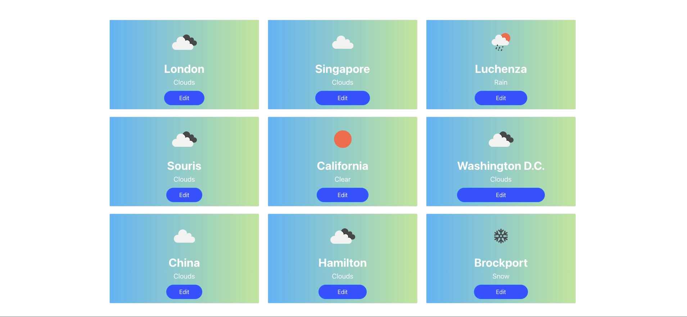

# Polybee Technical Assessment 
The following repo consist the features as requried from the document specificaiton.

<h3 align="center">
  
</h3>

# Getting started
### 1. Install deps
```
# install node modules
$ npm i 
```
### 2. Add environment file
```
$ mv .env.copy .env
```
### 3. Update the environment variables
Replace the YOUR_API_KEY with your custom open weather api key.
```
REACT_APP_WEATHER_API_KEY=YOUR_API_KEY
REACT_APP_PANELS=9
```
### 4. Run application
```
$ npm start
```
# Technology
The application was implemented with ReactJS

# Check list
- [x] 1. The app consists of a grid of 9 panels. Every panel shows the weather data of one city. Initially, all panels would be empty.
- [x] 2. On clicking on an empty panel, a text box is shown on the panel itself, asking the user to enter the city name. On entering the name, the panel now shows weather data for that city. 3. Every panel should have an “Edit” button - on clicking this, the user should be able to change the city shown in that panel.
- [x] 4. If there was an error in getting the data (eg. wrong city name), the panel itself shows the error and the user can re-enter the city name.
- [x] 5. Every panel has a background picture that describes the weather at the city - eg. sunny/rainy/cloudy.
- [x] 6. The panels should be in a grid and responsive - the panels should align themselves in a row with respect to the screen size: for small screens - less number of panels in a row and for large screens - more number of panels in a row.
Bonus Specifications :
If you’ve implemented all of the features above, well done to you! Now here are some bonus specifications for those who are up for a challenge!
- [x] 7. The weather data must be updated regularly - data displayed should be no more than 30 seconds old. This must not be done using a manual refresh button.
- [x] 8. Enable offline use - on refreshing the page, even when offline, the page shows the last obtained weather data. To implement this, use either HTML5 LocalStorage or IndexedDB (use the Angular IndexedDB wrapper if using this).